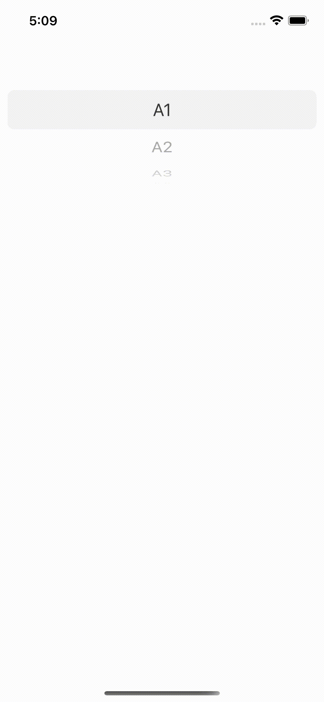
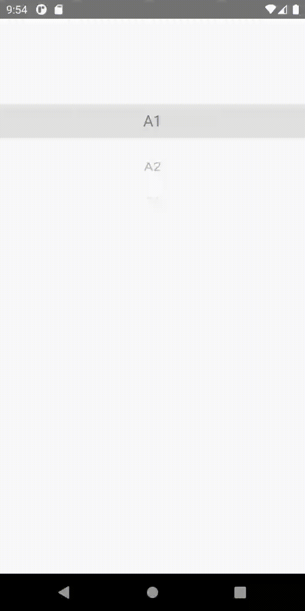
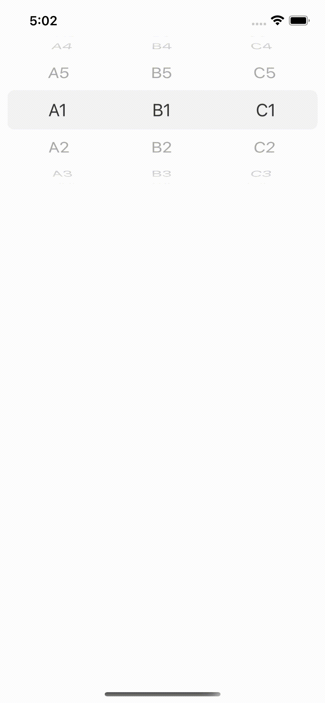
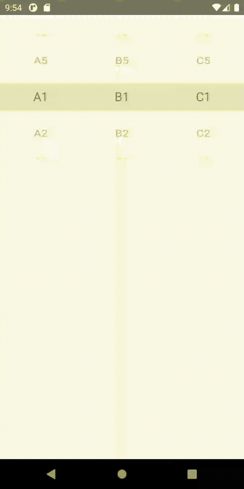

# ⛏️ react-native-picky

An awesome native wheel picker component for react-native.

## Features

- Supports multiple columns ✅

- Supports looping ✅

- Native Android and iOS components for improved performance ✅

- Typescript ✅

## Preview

| Preview                       | iOS                                                      | Android                                                      |
| ----------------------------- | -------------------------------------------------------- | ------------------------------------------------------------ |
| Single Column                 |      |      |
| Multiple Columns with looping |  |  |

## Installation

```sh
yarn add react-native-picky
```

## Quick Start

```tsx
import { Picker, PickerColumn, PickerItem } from 'react-native-picky';

export const Demo = () => (
  <Picker>
    <PickerColumn>
      <PickerItem label="Monday" value="Monday" />
      <PickerItem label="Tuesday" value="Tuesday" />
      <PickerItem label="Wednesday" value="Wednesday" />
      <PickerItem label="Thursday" value="Thursday" />
      <PickerItem label="Friday" value="Friday" />
    </PickerColumn>
  </Picker>
);
```

## Props

### `<Picker />`

| Property       | Type     | Description                                               | Platform     | Default              |
| -------------- | -------- | --------------------------------------------------------- | ------------ | -------------------- |
| loop           | boolean  | Enable looping options                                    | iOS, Android | false                |
| style          | object   | View style prop                                           | iOS, Android |                      |
| onChange       | function | A callback function when a value is changed in any column | iOS, Android |                      |
| numberOfLines  | number   | The number of lines for each row in a column              | iOS          | 1                    |
| hasCurtain     | boolean  | Enable the curtain to highlight the selected value        | Android      | true                 |
| curtainColor   | string   | Color of the curtain                                      | Android      | hsla(0, 0%, 0%, 0.1) |
| hasIndicator   | boolean  | Enable the indicator to highlight the selected value      | Android      | true                 |
| indicatorColor | string   | Color of the indicator                                    | Android      | hsla(0, 0%, 0%, 0.1) |
| indicatorSize  | number   | The size of the indicator                                 | Android      | 1                    |
| itemSpace      | number   | The amount of space between items                         | Android      | 12                   |
| textColor      | string   | The color of the item text                                | Android      | #000000              |
| textSize       | number   | The size of the item text                                 | Android      | 20                   |

### `<PickerColumn />`

| Property      | Type             | Description                                                | Platform     | Default                      |
| ------------- | ---------------- | ---------------------------------------------------------- | ------------ | ---------------------------- |
| selectedValue | string \| number | The selected value                                         | iOS, Android |                              |
| onChange      | function         | A callback function if the value is changed in this column | iOS, Android |                              |
| width         | number           | The width of this column                                   | iOS, Android | Takes up the available space |

### `<PickerItem />`

| Property | Type             | Description                | Platform     | Default |
| -------- | ---------------- | -------------------------- | ------------ | ------- |
| label    | string           | The label of the item      | iOS, Android |         |
| value    | string \| number | The value of the item      | iOS, Android |         |
| testID   | string           | The testID of the item     | iOS          |         |
| color    | string           | The color of the item text | iOS          |         |

## Contributing

See the [contributing guide](CONTRIBUTING.md) to learn how to contribute to the repository and the development workflow.

## License

MIT
